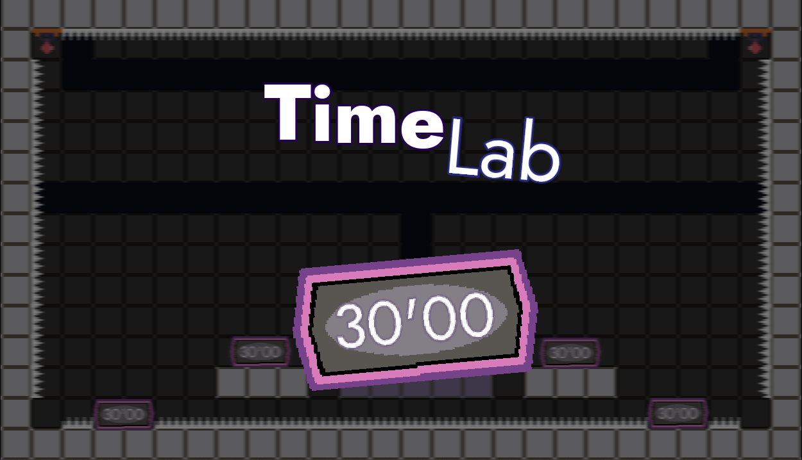
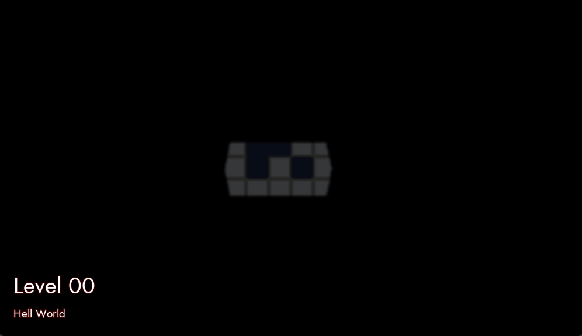

# Time Lab - Ludum Dare 50

You can view the [original README here](./LD_README.md).

|             |                                                                                |
|-------------|--------------------------------------------------------------------------------|
| **Theme**   | _Delay the inevitable_                                                         |
| **Date**    | _April 2022_                                                                   |
| **Type**    | _Compo_                                                                        |
| **Concept** | _2D platformer game where you have to finish puzzles with an unfair time bomb._|

**:rocket: [Play it here!](https://srynetix.github.io/time-lab/)**

Welcome on my 4th **Ludum Dare** Compo entry!

The concept is _once again_ simple: you are trapped in a laboratory, filled with puzzles, where time is your enemy.  
Instructions are included in the game, and _once again_, it is **quite challenging**.

There is a secret end, think fast :wink:!

**Software used**:
- Godot Engine 3.4.4 with my [`sxgd`](https://github.com/Srynetix/sxgd) addon,
- sfxia,
- aseprite 1.3-beta14,
- FL Studio

**Assets used**:
- Jost font (https://github.com/indestructible-type/Jost)

_Good luck, and have fun!_

## Preview

